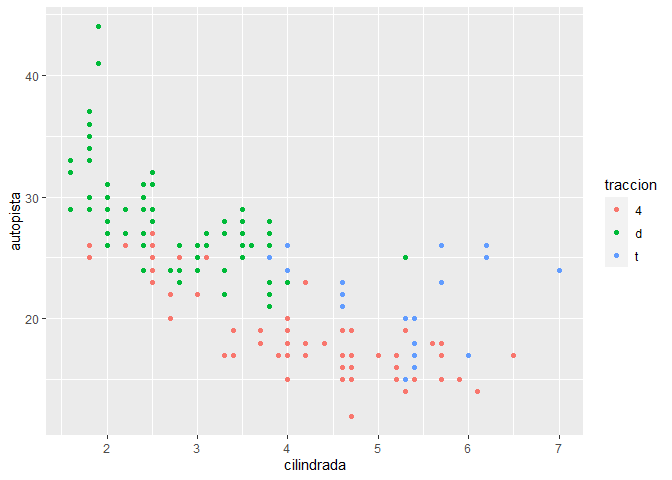
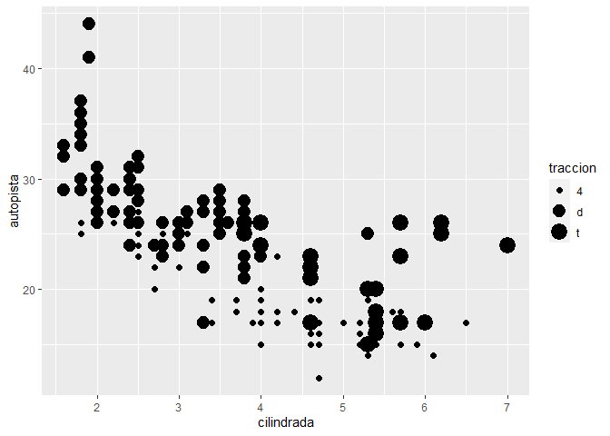
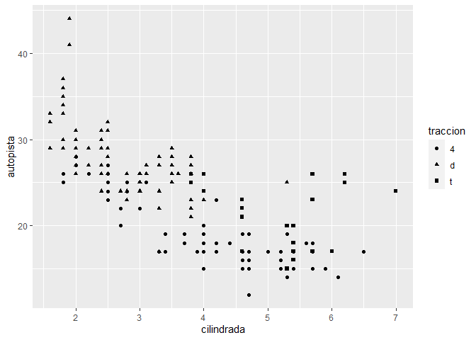
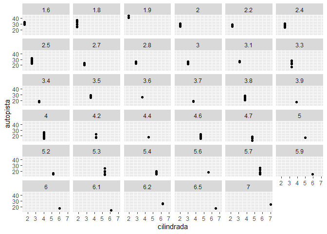
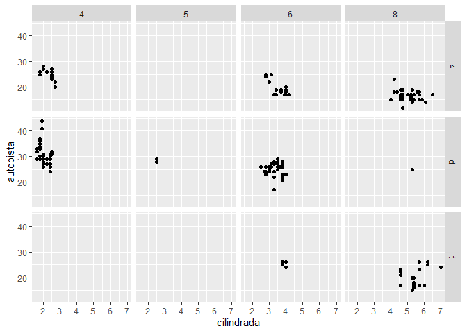
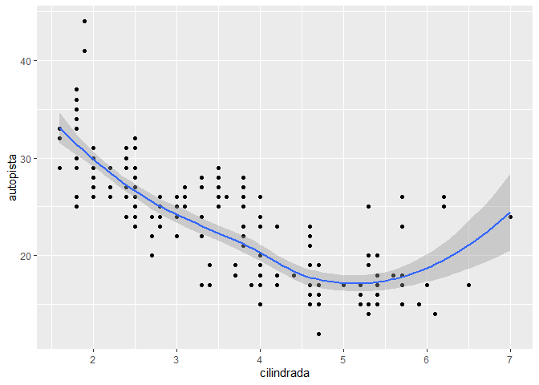
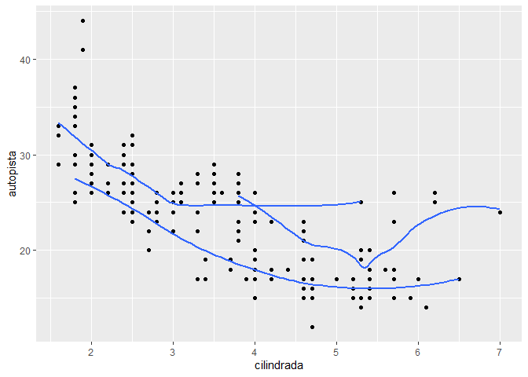

Tarea 4
================
Grupo 12
20/1/2022

``` r
library(ggplot2)
```

    ## Warning: package 'ggplot2' was built under R version 4.1.2

``` r
library(datos)
```

    ## Warning: package 'datos' was built under R version 4.1.2

``` r
millas
```

    ## # A tibble: 234 x 11
    ##    fabricante modelo     cilindrada  anio cilindros transmision traccion ciudad
    ##    <chr>      <chr>           <dbl> <int>     <int> <chr>       <chr>     <int>
    ##  1 audi       a4                1.8  1999         4 auto(l5)    d            18
    ##  2 audi       a4                1.8  1999         4 manual(m5)  d            21
    ##  3 audi       a4                2    2008         4 manual(m6)  d            20
    ##  4 audi       a4                2    2008         4 auto(av)    d            21
    ##  5 audi       a4                2.8  1999         6 auto(l5)    d            16
    ##  6 audi       a4                2.8  1999         6 manual(m5)  d            18
    ##  7 audi       a4                3.1  2008         6 auto(av)    d            18
    ##  8 audi       a4 quattro        1.8  1999         4 manual(m5)  4            18
    ##  9 audi       a4 quattro        1.8  1999         4 auto(l5)    4            16
    ## 10 audi       a4 quattro        2    2008         4 manual(m6)  4            20
    ## # ... with 224 more rows, and 3 more variables: autopista <int>,
    ## #   combustible <chr>, clase <chr>

# Ejercicios: ggplot2

## Parte 1: Ggplot base

### 1.Ejecuta ggplot(data = millas). ¿Qué observas?

``` r
ggplot(data = millas)
```

<!-- -->

``` r
#### El resultado en graphical output sale en blanco. 
```

### 2.¿Cuántas filas hay en millas? ¿Cuántas columnas?

#### Filas

``` r
#Núm. de filas:
dplyr::count(millas)
```

    ## # A tibble: 1 x 1
    ##       n
    ##   <int>
    ## 1   234

``` r
#Núm de columnas:
length(millas)
```

    ## [1] 11

### 3.¿Qué describe la variable traccion? Lee la ayuda de ?millas para encontrar la respuesta.

``` r
#### Según la ayuda de “millas” esta variable describe el tipo de tracción existente en el vehículo, son tres diferentes tipos: delantera (d), trasera (t) y en las cuatro ruedas (4). 
```

### 4.Realiza un gráfico de dispersión de autopista versus cilindros.

``` r
ggplot(data=millas)+
  geom_point(aes(autopista, cilindros))
```

<!-- -->

### 5.¿Qué sucede cuando haces un gráfico de dispersión (scatterplot) de clase versus tracción? ¿Por qué no es útil este gráfico?

``` r
ggplot(data=millas)+
  geom_point(aes(autopista, traccion))
```

<!-- --> #### No es
útil porque la tracción no es una variable numérica continua, por ello,
no se representará bien en un gráfico de dispersión que hace uso de los
ejes coordenados.

## Parte 2: Mapeos estéticos

### 1.¿Qué no va bien en este código? ¿Por qué hay puntos que no son azules?

``` r
ggplot(data = millas) +
   geom_point(mapping = aes(x = cilindrada, y = autopista, color = "blue"))
```

<!-- -->

#### En este código no se puede visualizar puntos azules debido a la ubicación del paréntesis , que para poder observar el color pedido debería estar después de la palabra autopista

### 2.¿Qué variables en millas son categóricas? ¿Qué variables son continuas? (Pista: escribe ?millas para leer la documentación de ayuda para este conjunto de datos). ¿Cómo puedes ver esta información cuando ejecutas millas?

#### Para saber que variables existe en millas debemos usar el siguiente código

“summary(millas)”. Observamos entonces que “fabricante”, “modelo”,
“transmision”,”traccion”,”combustible”, “clase” son variables
categóricas(se puede hacer grafica de barras) ; y
“cilindrada”,”anio”,”cilindros”, “ciudad”, “autopista” son variables
continuas(min,median,mean…etc) #### Podemos ver esta información con la
función “View(millas)”

### 3.Asigna una variable continua a color, size, y shape. ¿Cómo se comportan estas estéticas de manera diferente para variables categóricas y variables continuas?

``` r
ggplot(data = millas) + geom_point(mapping = aes(x = cilindrada, y = autopista, color = traccion))
```

<!-- -->

``` r
ggplot(data = millas) +
 geom_point(mapping = aes(x = cilindrada, y = autopista, color = anio))
```

<!-- -->

``` r
ggplot(data = millas) +
 geom_point(mapping = aes(x = cilindrada, y = autopista, size = traccion))
```

    ## Warning: Using size for a discrete variable is not advised.

<!-- -->

``` r
ggplot(data = millas) +
 geom_point(mapping = aes(x = cilindrada, y = autopista, size = anio))
```

<!-- -->

``` r
ggplot(data = millas) +
 geom_point(mapping = aes(x = cilindrada, y = autopista, shape=traccion))
```

<!-- -->

``` r
ggplot(data = millas) +
 geom_point(mapping = aes(x = cilindrada, y = autopista, shape=clase))
```

    ## Warning: The shape palette can deal with a maximum of 6 discrete values because
    ## more than 6 becomes difficult to discriminate; you have 7. Consider
    ## specifying shapes manually if you must have them.

    ## Warning: Removed 62 rows containing missing values (geom_point).

<!-- -->

#### Elegimos sólo una variable continua para color, size y shape, “cilindros”,

De forma general podemos decir que todas las variables continuas generan
una leyenda al costado del gráfico, de la misma forma sucede en el
tamaño.Al plotear el último código podemos observar que no nos sale el
gráfico , eso se debe porque ggplot2 solo permite usar 6 formas a la vez
.

### 4.¿Qué ocurre si asignas o mapeas la misma variable a múltiples estéticas?

Ejemplo: Variable continua “autopista” ggplot(data = millas)+
geom_point(mapping =
aes(x=autopista,y=autopista,color=autopista,size=autopista))

Se observa una combinación entre el color y el tamaño(size) de la
respectiva variable continua

### 5.¿Qué hace la estética stroke? ¿Con qué formas trabaja? (Pista: consulta ?geom_point)

#### stroke: Modifica el tamaño o ancho del borde.

#### trabaja con todas las formas.

### 6.¿Qué ocurre si se asigna o mapea una estética a algo diferente del nombre de una variable, como aes(color = cilindrada \< 5)?

``` r
 ggplot(data = millas) +
   geom_point(mapping = aes(x = cilindrada, y = autopista, color = cilindrada < 5))
```

<!-- --> #### Si
asignamos color con una expresión lógica, creamos una leyenda con dos
colores, uno si es que se cumple (TRUE) y otro si es que no se cumple
(FALSE) ## Parte 3: Facetas ### 1.¿Qué ocurre si intentas separar en
facetas una variable continua?

``` r
ggplot(data = millas) +
  geom_point(mapping = aes(x = cilindrada, y = autopista)) +
  facet_wrap(~ cilindrada)
```

<!-- --> #### Las
facetas puede dividirse en cada valor que la variable elegida pueda
tomar.

### 2.¿Qué significan las celdas vacías que aparecen en el gráfico generado usando facet_grid(traccion \~ cilindros)?

``` r
ggplot(data = millas) +
  geom_point(mapping = aes(x = cilindrada, y = autopista)) +
  facet_grid(traccion ~ cilindros)
```

<!-- --> #### Se
separa el gráfico de acuerdo a las combinaciones de variables. Las
celdas vacías son signos de que en ocasiones no se cumplen las dos
variables.

### 3.¿Cómo se relacionan con este gráfico?

``` r
ggplot(data = millas) +
  geom_point(mapping = aes(x = traccion, y = cilindros))
```

<!-- --> #### el
segundo no presenta variables que condicionen la distribución que estas
pueden tener en la tabla.

### 4.¿Qué grafica el siguiente código? ¿Qué hace . ?

``` r
ggplot(data = millas) +
  geom_point(mapping = aes(x = cilindrada, y = autopista)) +
  facet_grid(traccion ~ .)
```

<!-- -->

``` r
ggplot(data = millas) +
  geom_point(mapping = aes(x = cilindrada, y = autopista)) +
  facet_grid(. ~ cilindros)
```

<!-- --> #### Si se
prefiere no separar en facetas las filas o columnas, reemplaza por una .
el nombre de alguna de las variables

### 5.Mira de nuevo el primer gráfico en facetas presentado en esta sección:

``` r
ggplot(data = millas) +
  geom_point(mapping = aes(x = cilindrada, y = autopista)) +
  facet_wrap(~ clase, nrow = 2)
```

<!-- -->

### a.¿Cuáles son las ventajas de separar en facetas en lugar de aplicar una estética de color? ¿Cuáles son las desventajas?

#### La ventaja que presenta el emplear “Las facetas” es que nos pueden mostrar subconjuntos de los datos que se tienen, es decir, dividen el gráfico, mientras que la estética de color no puede lograr ello de manera ordenada.

#### Su principal desventaja es que al tener todo dividido, puede generar un exceso de facetas de las que analizar.

### b.¿Cómo cambiaría este balance si tuvieras un conjunto de datos más grande? - Lee ?facet_wrap. ¿Qué hace nrow? ¿Qué hace ncol? ¿Qué otras opciones controlan el diseño de los paneles individuales?

#### Por un lado, nrow cumple la función de señalar la cantidad de filas que hay en la gráfica. En cambio, ncol cumple la función de señalar la cantidad de columnas que hay en la gráfica. Asimismo, faced_grid() no tiene argumentos nrow y ncol ya que en su reemplazo se emplea row y cols respectivamente.

### c.¿Por qué facet_grid() no tiene argumentos nrow y ncol? - Cuando usas facet_grid(), generalmente deberías poner la variable con un mayor número de niveles únicos en las columnas. ¿Por qué?

#### Cuando se coloca la variable de mayor número de niveles únicos en las columnas, el gráfico que este brinda es mucho más amplio y fácil de entender.

## Parte 4: Objetos geométricos

### 1.¿Qué geom usarías para generar un gráfico de líneas? ¿Y para un diagrama de caja? ¿Y para un histograma? ¿Y para un gráfico de área?

``` r
Línea = geom_line()
Línea
```

    ## geom_line: na.rm = FALSE, orientation = NA
    ## stat_identity: na.rm = FALSE
    ## position_identity

``` r
Cajas = geom_boxplot()
Cajas
```

    ## geom_boxplot: outlier.colour = NULL, outlier.fill = NULL, outlier.shape = 19, outlier.size = 1.5, outlier.stroke = 0.5, outlier.alpha = NULL, notch = FALSE, notchwidth = 0.5, varwidth = FALSE, na.rm = FALSE, orientation = NA
    ## stat_boxplot: na.rm = FALSE, orientation = NA
    ## position_dodge2

``` r
Histograma = geom_histogram()
Histograma
```

    ## geom_bar: na.rm = FALSE, orientation = NA
    ## stat_bin: binwidth = NULL, bins = NULL, na.rm = FALSE, orientation = NA, pad = FALSE
    ## position_stack

``` r
Área = geom_area()
Área
```

    ## geom_area: na.rm = FALSE, orientation = NA, outline.type = upper
    ## stat_identity: na.rm = FALSE
    ## position_stack

### 2.Ejecuta este código en tu mente y predice cómo se verá el output. Luego, ejecuta el código en R y verifica tus predicciones.

``` r
ggplot(data = millas, mapping = aes(x = cilindrada, y = autopista, color = traccion)) +
  geom_point() +
  geom_smooth(se = FALSE)
```

    ## `geom_smooth()` using method = 'loess' and formula 'y ~ x'

<!-- -->

### 3.¿Qué muestra show.legend = FALSE? ¿Qué pasa si lo quitas? ¿Por qué crees que lo utilizamos antes en el capítulo?

#### Nos muestra la leyenda. Cuando se usa FALSE esta no se va presentar pero si no, entonces esté sí se muestra.

### ¿4.Qué hace el argumento se en geom_smooth()?

#### Crea un suavizado para el gráfico

### 5.¿Se verán distintos estos gráficos? ¿Por qué sí o por qué no?

``` r
ggplot(data = millas, mapping = aes(x = cilindrada, y = autopista)) +
  geom_point() +
  geom_smooth()
```

    ## `geom_smooth()` using method = 'loess' and formula 'y ~ x'

<!-- -->

``` r
ggplot() +
  geom_point(data = millas, mapping = aes(x = cilindrada, y = autopista)) +
  geom_smooth(data = millas, mapping = aes(x = cilindrada, y = autopista))
```

    ## `geom_smooth()` using method = 'loess' and formula 'y ~ x'

<!-- -->

#### No, porque en el segundo gráfico la data de la función ggplot no es colocada, mientras que las siguientes funciones sí, por lo tanto, el gráfico se mantendrá igual al del primer caso.

### 6.Recrea el código R necesario para generar los siguientes gráficos:

``` r
ggplot(data = millas, mapping = aes(x = cilindrada, y = autopista)) +
  geom_point() +
  geom_smooth(se = FALSE)
```

    ## `geom_smooth()` using method = 'loess' and formula 'y ~ x'

<!-- -->

``` r
ggplot(data = millas, mapping = aes(x = cilindrada, y = autopista, group = traccion)) +
  geom_point() +
  geom_smooth(se = FALSE)
```

    ## `geom_smooth()` using method = 'loess' and formula 'y ~ x'

<!-- -->

``` r
ggplot(data = millas, mapping = aes(x = cilindrada, y = autopista, color = traccion)) +
  geom_smooth(se = FALSE) + geom_point()
```

    ## `geom_smooth()` using method = 'loess' and formula 'y ~ x'

<!-- -->

``` r
ggplot(data = millas, mapping = aes(x = cilindrada, y = autopista)) +
  geom_point(mapping = aes(x = cilindrada, y = autopista, color = traccion)) +
  geom_smooth(mapping = aes(x = cilindrada, y = autopista, linetype = traccion), se = FALSE)
```

    ## `geom_smooth()` using method = 'loess' and formula 'y ~ x'

<!-- -->

``` r
ggplot(data = millas, mapping = aes(x = cilindrada, y = autopista, color = traccion)) +
  geom_point(colour = "white", size = 5) +
  geom_point(aes(colour = factor(traccion)), size = 2)
```

<!-- -->

## Parte 5: Gráficos estadísticos

### 1.¿Cuál es el geom predeterminado asociado con stat_summary()? ¿Cómo podrías reescribir el gráfico anterior para usar esa función geom en lugar de la función stat?

``` r
ggplot(data = diamantes) +
  stat_summary(
    mapping = aes(x = corte, y = profundidad),
    fun.min = min,
    fun.max = max,
    fun = median
  )
```

<!-- -->

``` r
?stat_summary
```

    ## starting httpd help server ... done

``` r
# pointrange
ggplot(data = diamantes) +
  geom_pointrange(mapping = aes(x = corte, y = profundidad),
                  stat = "summary",
                  fun.min = min,
                  fun.max = max,
                  fun = median)
```

<!-- -->

### 2.¿Qué hace geom_col()? ¿En qué se diferencia de geom_bar()?

``` r
?geom_col
# stat_identity()
# Require x e y
```

``` r
?geom_bar
# stat_count()
# Solo require x
```

### 3.La mayoría de los geoms y las transformaciones estadísticas vienen en pares que casi siempre se usan en conjunto. Lee la documentación y haz una lista de todos los pares. ¿Qué tienen en común?

``` r
objetos <- getNamespaceExports("ggplot2")
geoms <- objetos[grepl("geom_", objetos)]
stats <- objetos[grepl("stat_", objetos)]
geoms_filtrados <- sort(geoms[geoms %in% paste0("geom_", gsub("stat_", "", stats))])
stats_filtrados <- paste0("stat_", gsub("geom_", "", geoms_filtrados))
v_pares <- tibble::tibble(geoms = geoms_filtrados, stats = stats_filtrados)
v_pares
```

    ## # A tibble: 18 x 2
    ##    geoms                  stats                 
    ##    <chr>                  <chr>                 
    ##  1 geom_bin_2d            stat_bin_2d           
    ##  2 geom_bin2d             stat_bin2d            
    ##  3 geom_boxplot           stat_boxplot          
    ##  4 geom_contour           stat_contour          
    ##  5 geom_contour_filled    stat_contour_filled   
    ##  6 geom_count             stat_count            
    ##  7 geom_density           stat_density          
    ##  8 geom_density_2d        stat_density_2d       
    ##  9 geom_density_2d_filled stat_density_2d_filled
    ## 10 geom_density2d         stat_density2d        
    ## 11 geom_density2d_filled  stat_density2d_filled 
    ## 12 geom_function          stat_function         
    ## 13 geom_qq                stat_qq               
    ## 14 geom_qq_line           stat_qq_line          
    ## 15 geom_quantile          stat_quantile         
    ## 16 geom_sf                stat_sf               
    ## 17 geom_smooth            stat_smooth           
    ## 18 geom_spoke             stat_spoke

### 4.¿Qué variables calcula stat_smooth()? ¿Qué parámetros controlan su comportamiento?

``` r
ggplot()+stat_smooth(data=millas, aes(x=autopista, y=cilindrada))
```

    ## `geom_smooth()` using method = 'loess' and formula 'y ~ x'

<!-- --> ####
stat_smooth sirve para calcular la gráfica a forma de una línea tomando
a la desviación estándar como un suavizado, es decir, halla el error
estándar y el intervalo superior e inferior de confianza. #### Los
parámetros que la controlan se encuentra “se” la cual es capaz de
determinar si se puede plotear o no el error estándar. Asimismo, el
parámetro “na.rm” es capaz de determinar si los valores NA serán
eliminados.

### 5.En nuestro gráfico de barras de proporción necesitamos establecer group = 1. ¿Por qué? En otras palabras, ¿cuál es el problema con estos dos gráficos?

``` r
ggplot(data = diamantes) +
  geom_bar(mapping = aes(x = corte, y = ..prop..))
```

<!-- -->

``` r
ggplot(data = diamantes) +
  geom_bar(mapping = aes(x = corte, fill = color, y = ..prop..))
```

<!-- --> #### Sin
group = 1 las proporciones son calculadas para cada grupo (cada barra),
por ello todas las barras tienen la misma altura..

``` r
ggplot(data = diamantes) +
  geom_bar(mapping = aes(x = corte, y = ..prop.., group = 1))
```

<!-- --> #### Ahora
las proporciones son calculadas para todos los grupos, es decir, todas
las barras. #### Para obtener el resultado deseado, cada barra tiene que
ser normalizada:

``` r
ggplot(data = diamantes) +
  geom_bar(mapping = aes(x = corte, fill = color, y = ..count.. / sum(..count..)))
```

<!-- -->

## Parte 6: Ajuste de posición

### 1.¿Cuál es el problema con este gráfico? ¿Cómo podrías mejorarlo?

``` r
ggplot(data = millas, mapping = aes(x = ciudad, y = autopista)) +
  geom_point()
```

<!-- --> #### Como
muchos puntos se overlapan, podríamos usar position = “jitter” para
añadir ruido a nuestros puntos:

``` r
ggplot(data = millas, mapping = aes(x = ciudad, y = autopista)) +
  geom_point(position = "jitter")
```

<!-- --> ###
2.Sucede que muchos puntos se overlapan, podríamos usar position =
“jitter” para añadir ruido a nuestros puntos:

``` r
ggplot(data = millas, mapping = aes(x = ciudad, y = autopista)) +
  geom_point(position = "jitter")
```

<!-- -->

### 3.¿Qué parámetros de geom_jitter() controlan la cantidad de ruido?

``` r
?geom_jitter()
```

#### Parámetros:

##### width: eje horizontal

##### height: eje vertical

``` r
ggplot(data = millas, mapping = aes(x = ciudad, y = autopista)) +
  geom_jitter(width = 0)
```

<!-- -->

``` r
ggplot(data = millas, mapping = aes(x = ciudad, y = autopista)) +
  geom_jitter(width = 20)
```

<!-- -->

``` r
ggplot(data = millas, mapping = aes(x = ciudad, y = autopista)) +
  geom_jitter(height = 0)
```

<!-- -->

``` r
ggplot(data = millas, mapping = aes(x = ciudad, y = autopista)) +
  geom_jitter(height = 20)
```

<!-- -->

### Compara y contrasta geom_jitter() con geom_count()

``` r
ggplot(data = millas, mapping = aes(x = ciudad, y = autopista)) +
  geom_jitter()
```

<!-- -->

``` r
ggplot(data = millas, mapping = aes(x = ciudad, y = autopista)) +
  geom_count()
```

<!-- -->

``` r
ggplot(data = millas, mapping = aes(x = ciudad, y = autopista, color = clase)) +
  geom_count(position = "jitter")
```

<!-- -->

### 4.¿Cuál es el ajuste de posición predeterminado de geom_boxplot()? Crea una visualización del conjunto de datos de millas que lo demuestre.

``` r
?geom_boxplot()
ggplot(data = millas, mapping = aes(x = ciudad, y = autopista, color = clase)) +
  geom_boxplot()
```

<!-- -->

``` r
ggplot(data = millas, mapping = aes(x = ciudad, y = autopista, color = clase)) +
  geom_boxplot(position = "identity")
```

<!-- --> ## Parte 7:
Sistema de coordenadas ### 1.Convierte un gráfico de barras apiladas en
un gráfico circular usando coord_polar().

``` r
ggplot(millas, aes(x = factor(1), fill = traccion)) +
  geom_bar()
```

<!-- -->

``` r
ggplot(millas, aes(x = factor(1), fill = traccion)) +
  geom_bar(width = 1) +
  coord_polar(theta = "y")
```

<!-- -->

### 2.¿Qué hace labs()? Lee la documentación.

``` r
?labs
ggplot(data = mpg, mapping = aes(x = class, y = hwy)) +
  geom_boxplot() +
  coord_flip() +
  labs(y = "Millas por galón de combustible en autopista",
       x = "Tipo de auto",
       title = "Datos de economía de combustible",
       subtitle = "1999-2008",
       caption = "Fuente: http://fueleconomy.gov")
```

<!-- -->

### 3.¿Cuál es la diferencia entre coord_quickmap() y coord_map()?

``` r
?coord_quickmap
?coord_map
```

### 4.¿Qué te dice la gráfica siguiente sobre la relación entre ciudad y autopista?

¿Por qué es coord_fixed() importante? ¿Qué hace geom_abline()?

``` r
ggplot(data = millas, mapping = aes(x = ciudad, y = autopista)) +
  geom_point() +
  geom_abline() +
  coord_fixed()
```

<!-- -->

``` r
ggplot(data = millas, mapping = aes(x = ciudad, y = autopista)) +
  geom_point() +
  geom_abline() +
  coord_fixed()
```

<!-- -->

``` r
?coord_fixed
?geom_abline
```
